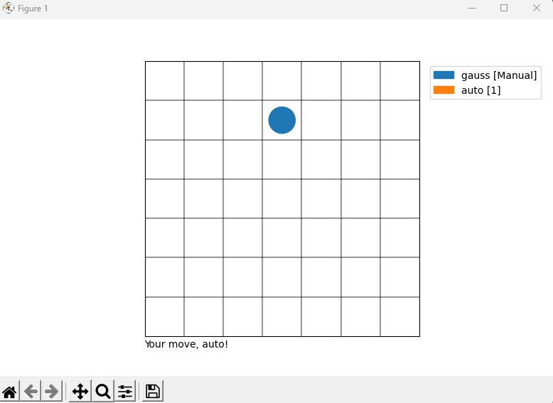

# Playing Caro

Matplotlib for a rudimentary GUI, and pre-computed data for 2-player tictactoe.

The program is written to work with up to 20 players, of user-defined board size.

You will need to define the number of consecutive pieces to be considered winning, with 
the `--win_count` argument, which defaults to be 5.

This might accidentally  be the solution to your school project, but if you 
build it from here, think about Chess, or Go. `3-dimensional chess` is also a viable option.

How would you design difficulty levels for the Auto player?
## Usage 

```commandline
> python main.py -h
usage: main.py [-h] [--size N] [--win_count C] name [name ...]

Play a game

positional arguments:
  name                 names of the players. Must have at least two players.
                       Use `auto` for an exceptionally smart auto-player

optional arguments:
  -h, --help           show this help message and exit
  --size N, -s N       size of the board. Default: 20
  --win_count C, -w C  Number of consecutive pieces to be considered winning. Default: 5
  
# For a tictactoe game with automatic player:
> python main.py -s 3 -w 3 <your name> auto
```

## Data generation

Generating pre-computed data for 3-player Caro game with board of size 20x20 and 
5 consecutive pieces to be considered winning:

```commandline
> python generate.py -p 3 -s 20 -w 5
```

## GUI

```commandline
> python -s 7 -w 3 gauss auto
```

